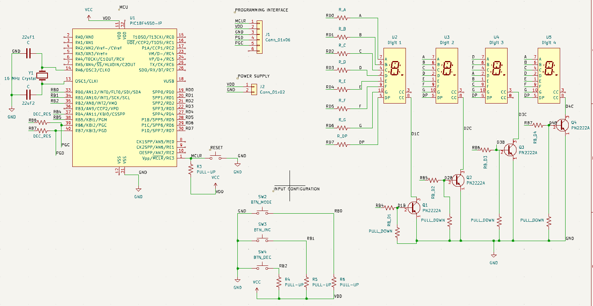

# DIGITAL CLOCK

## Overview

This is a bare-metal C project based on the Microchip PIC18F4550 microcontroller that implements a digital clock.
The system uses multiplexed seven-segment displays to show the current time and provides a push-button interface for user configuration.
The configured time is stored in the internal EEPROM memory.

## Features

- Modular driver-based firmware architecture
- Timer2-driven system tick for timekeeping and scheduling
- Multiplexed seven-segment display control
- Push-button interface for user configuration
- EEPROM-based non-volatile time storage

## Hardware 

- Microchip PIC18F4550 microcontroller with a 16 MHz external crystal oscillator 
- Multiplexed common-cathode seven-segment display
- NPN transistors for digit control
- Push-button interface with pull-up resistors

## Software architecture

The firmware is organized using a modular architecture that separates hardware drivers from application logic.

The modules include:

- GPIO HAL for low-level pin control
- Display driver for multiplexed seven-segment control
- Button driver for user input handling
- System tick dirver providing a 1 ms time base
- EEPROM driver for non-volatile data storage
- Clock driver for real-time management
- UART driver for testing and debugging

## How It Works?

The system operates on a 1 ms system tick generated by the Timer2 peripherial.
The tick drives a cooperative scheduler responsible for executing periodic tasks and maintaining the system time.
The scheduler manages key tasks such as button input processing, display multiplexing, and timekeeping.
This approach ensures accurate timing efficient CPU utilization.

## Build Instruction
```bash
make all
make flash
make clean
```
## Schematic

